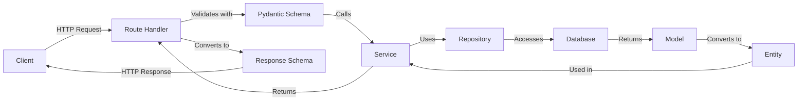

# 📚 Authentication System Documentation

Welcome to the Descubre Boyacá authentication system documentation.

## Contents

### 🔐 Authentication Flows

1. **[Traditional Authentication](./traditional_flow.md)** - Email and Password
   - User registration
   - Login with credentials
   - JWT token management
   - Refresh tokens

2. **[Google OAuth 2.0 Authentication](./oauth_flow.md)**
   - Complete OAuth flow
   - Google integration
   - Callbacks and tokens
   - Automatic registration

## Quick Comparison

| Feature | Email/Password | Google OAuth |
|----------------|----------------|--------------|
| **Password** | ✅ Required | ❌ Not applicable |
| **Registration** | Manual | Automatic |
| **Email Verification** | 🚧 To implement | ✅ Google handles it |
| **2FA** | 🚧 To implement | ✅ Google handles it |
| **Password Recovery** | 🚧 To implement | ❌ Not applicable |
| **Security** | bcrypt (cost 12) | OAuth 2.0 |
| **UX** | Traditional | One click |

## Available Endpoints

### Traditional Authentication

| Method | Endpoint | Description | Auth Required |
|--------|----------|-------------|---------------|
| POST | `/auth/register` | Register new user | ❌ |
| POST | `/auth/login` | Login | ❌ |
| POST | `/auth/refresh` | Renew access token | ❌ |
| GET | `/auth/me` | Get current user | ✅ |

### Google OAuth

| Method | Endpoint | Description | Auth Required |
|--------|----------|-------------|---------------|
| GET | `/auth/google/login` | Start OAuth flow | ❌ |
| GET | `/auth/google/callback` | Google callback | ❌ |

## Architecture

```
app/domains/auth/
├── docs/                      # 📚 Documentation (you are here)
│   ├── README.md
│   ├── traditional_flow.md
│   └── oauth_flow.md
├── domain/                    # 🏛️ Business logic
│   ├── entities/             # Domain entities
│   ├── enums/                # Enumerations
│   ├── exceptions/           # Domain exceptions
│   ├── interfaces/           # Interfaces/Contracts
│   └── value_objects/        # Value objects
├── models/                    # 🗄️ Database models
│   └── user.py
├── repositories/              # 📦 Data layer
│   └── user/
│       ├── postgresql.py
│       └── sqlite.py
├── routes/                    # 🛣️ HTTP endpoints
│   ├── register.py
│   ├── login.py
│   ├── refresh.py
│   ├── me.py
│   ├── google_login.py
│   └── google_callback.py
├── schemas/                   # 📋 Request/Response schemas
│   ├── user.py
│   ├── register.py
│   ├── login.py
│   ├── refresh.py
│   ├── me.py
│   ├── google_login.py
│   └── google_callback.py
├── services/                  # ⚙️ Application services
│   ├── auth.py
│   ├── token.py
│   ├── password.py
│   └── google_oauth.py
└── dependencies/              # 🔌 Dependency injection
    ├── auth.py
    ├── security.py
    └── sql.py
```

## Request Flow



## Technology Stack

### Backend
- **Framework**: FastAPI 0.115+
- **ORM**: SQLModel (SQLAlchemy + Pydantic)
- **Validation**: Pydantic 2.9+
- **Auth**: JWT (python-jose)
- **Password Hashing**: bcrypt (passlib)
- **HTTP Client**: httpx (for OAuth)

### Database
- **Development**: SQLite
- **Production**: PostgreSQL
- **Migrations**: Alembic

### Security
- **JWT Algorithm**: HS256
- **Password Hashing**: bcrypt (cost factor 12)
- **Token Storage**: Client-side (localStorage/cookies)
- **CORS**: Configured per environment

## Configuration

### Environment Variables (.env)

```bash
# Database
DATABASE_URL=sqlite:///./local.db  # or postgresql://...

# JWT Configuration
JWT_SECRET_KEY=your-secret-key-minimum-32-characters
JWT_ALGORITHM=HS256
JWT_ACCESS_TOKEN_EXPIRE_MINUTES=30
JWT_REFRESH_TOKEN_EXPIRE_DAYS=7

# Google OAuth (optional)
GOOGLE_CLIENT_ID=your-client-id.apps.googleusercontent.com
GOOGLE_CLIENT_SECRET=GOCSPX-your-client-secret
GOOGLE_REDIRECT_URI=http://localhost:8000/api/v1/auth/google/callback
```

### Installation

```bash
# Clone repository
git clone https://github.com/your-org/descubreboyaca-backend.git
cd descubreboyaca-backend

# Install dependencies with uv
uv sync

# Configure environment variables
cp .env.example .env
# Edit .env with your values

# Run migrations
alembic upgrade head

# Start server
fastapi dev app/main.py
```

## Testing

### Swagger UI
```
http://localhost:8000/docs
```

### ReDoc
```
http://localhost:8000/redoc
```

### cURL Examples

See individual files:
- [traditional_flow.md](./traditional_flow.md#manual-testing)
- [oauth_flow.md](./oauth_flow.md)

## Security

### Implemented Best Practices

✅ **Password Hashing**: bcrypt with cost factor 12  
✅ **JWT Tokens**: Signed with HS256  
✅ **Token Expiration**: Short-lived access tokens  
✅ **Refresh Tokens**: For session renewal  
✅ **Unique Email**: Database-level constraint  
✅ **OAuth 2.0**: Secure flow with Google  
✅ **HTTPS**: Required in production  
✅ **CORS**: Configured per environment  
✅ **Exception Handling**: Centralized  
✅ **Input Validation**: Pydantic schemas  

### 🚧 To Implement

- [ ] Email verification via email
- [ ] Password recovery
- [ ] 2FA (Two-Factor Authentication)
- [ ] Rate limiting per IP
- [ ] Failed login attempt logging
- [ ] Account lockout after X attempts
- [ ] Refresh token rotation
- [ ] Token whitelist/blacklist

## Roles and Permissions

### Available Roles

- **user** (default): Regular user
- **admin**: System administrator
- **owner**: Restaurant owner

### Role Verification

```python
from app.domains.auth.dependencies import get_current_admin

@router.get("/admin-only")
async def admin_endpoint(
    current_user: User = Depends(get_current_admin)
):
    # Only accessible by admins
    pass
```

## Frequently Asked Questions

### Can I use both authentication methods?

No, not for the same email. If a user registers with email/password, they cannot use Google OAuth with that same email and vice versa. They are independent flows.

### How do I change token duration?

Edit the variables in your `.env`:
```bash
JWT_ACCESS_TOKEN_EXPIRE_MINUTES=60  # 1 hour
JWT_REFRESH_TOKEN_EXPIRE_DAYS=30    # 30 days
```

### How do I add more OAuth providers?

1. Create a new service (e.g., `facebook_oauth.py`)
2. Implement OAuth client similar to `GoogleOAuthClient`
3. Create routes for login and callback
4. Add the provider to the `AuthProvider` enum
5. Update the `AuthService.login_with_oauth()` service

### How do I test protected endpoints?

1. Login and get the `access_token`
2. Add header: `Authorization: Bearer <access_token>`
3. Make the request to the protected endpoint

### What happens if the refresh token expires?

The user must login again. There's no way to renew an expired refresh token for security reasons.

## Support

For more information or to report bugs:

- 📖 [General Architecture](../../../ARCHITECTURE.md)
- 🔧 [Google OAuth Setup Guide](../../../GOOGLE_OAUTH_SETUP.md)
- 🐛 [GitHub Issues](https://github.com/your-org/descubreboyaca-backend/issues)

---

**Last updated**: 2024-10-26  
**Version**: 1.0.0
