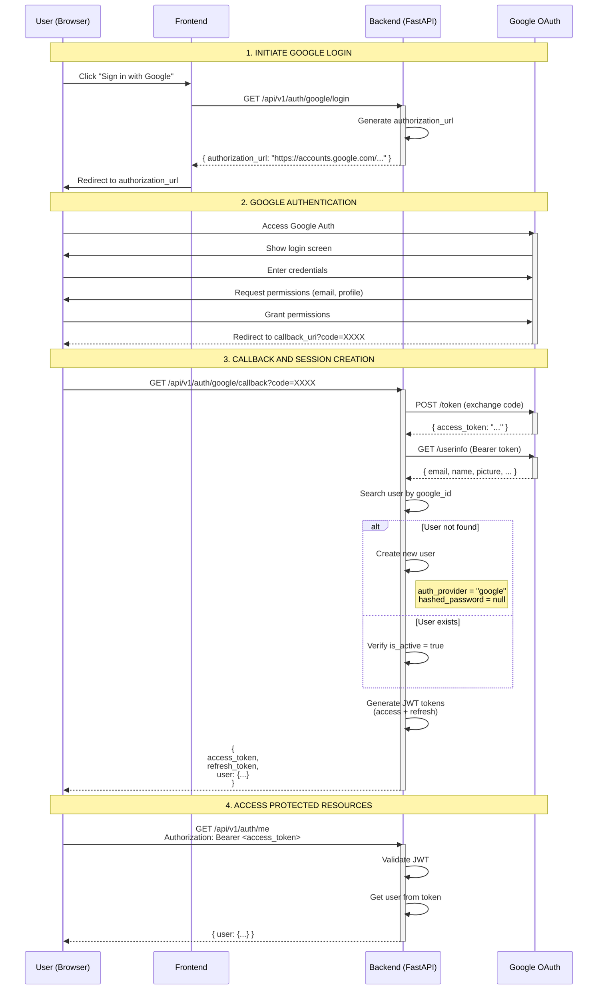

# 🔐 Google OAuth 2.0 Authentication Flow

This document describes the complete authentication flow using Google OAuth 2.0 in the Descubre Boyacá application.

## Sequence Diagram



## Flow Description

### Phase 1: OAuth Flow Initialization

1. **User clicks** "Sign in with Google"
2. **Frontend requests** the authorization URL from backend
3. **Backend generates** the URL with required parameters:
   - `client_id`: Application ID in Google
   - `redirect_uri`: Registered callback URL
   - `scope`: Requested permissions (email, profile)
   - `response_type`: code (Authorization Code Flow)
4. **Frontend redirects** user to Google

### Phase 2: Google Authentication

5. **Google displays** the login screen
6. **User enters** their Google credentials
7. **Google requests** consent to share information
8. **User grants** permissions
9. **Google redirects** back to callback with a temporary code

### Phase 3: Code Exchange and Session Creation

10. **Backend receives** the authorization code
11. **Backend exchanges** the code for an access token:
    - POST to `https://oauth2.googleapis.com/token`
    - Sends: code, client_id, client_secret, redirect_uri
12. **Google returns** the access token
13. **Backend fetches** user profile:
    - GET to `https://www.googleapis.com/oauth2/v2/userinfo`
    - Header: `Authorization: Bearer <access_token>`
14. **Backend searches** if user already exists by `google_id`
15. **If not found**, creates a new user with:
    - `email`: from Google profile
    - `full_name`: from Google profile
    - `auth_provider`: "google"
    - `google_id`: Google's unique ID
    - `profile_picture_url`: profile picture from Google
    - `hashed_password`: null (doesn't use password)
16. **If found**, verifies user is active
17. **Backend generates** its own JWT tokens (access + refresh)
18. **Backend returns** tokens and user data

### Phase 4: Application Usage

19. **User uses** the access token in each request
20. **Backend validates** the JWT on each protected endpoint
21. When token expires, uses refresh token to renew

## Endpoints Involved

### `GET /api/v1/auth/google/login`

**Description**: Initiates the OAuth flow by returning the authorization URL.

**Response**:
```json
{
  "authorization_url": "https://accounts.google.com/o/oauth2/v2/auth?client_id=...",
  "message": "Redirect user to this URL for Google authentication"
}
```

### `GET /api/v1/auth/google/callback?code=XXXX`

**Description**: Receives the Google code and completes authentication.

**Query Parameters**:
- `code` (required): Authorization code from Google

**Response**:
```json
{
  "access_token": "eyJhbGciOiJIUzI1NiIsInR5cCI6IkpXVCJ9...",
  "refresh_token": "eyJhbGciOiJIUzI1NiIsInR5cCI6IkpXVCJ9...",
  "token_type": "bearer",
  "user": {
    "id": "01JXXXXXXXXX",
    "email": "user@gmail.com",
    "full_name": "Usuario Ejemplo",
    "role": "user",
    "is_active": true,
    "auth_provider": "google",
    "google_id": "123456789",
    "profile_picture_url": "https://lh3.googleusercontent.com/...",
    "created_at": "2024-10-26T10:30:00Z"
  }
}
```

## Required Configuration

### Environment Variables

```bash
GOOGLE_CLIENT_ID=123456789-abcdef.apps.googleusercontent.com
GOOGLE_CLIENT_SECRET=GOCSPX-abc123xyz789
GOOGLE_REDIRECT_URI=http://localhost:8000/api/v1/auth/google/callback
```

### Google Cloud Console

1. **Create project** in Google Cloud Console
2. **Enable** Google+ API or People API
3. **Configure** OAuth consent screen
4. **Create credentials** OAuth 2.0 Client ID
5. **Add** redirect URI: `http://localhost:8000/api/v1/auth/google/callback`

See complete guide: [`GOOGLE_OAUTH_SETUP.md`](../../../GOOGLE_OAUTH_SETUP.md)

## Security

### JWT Tokens

- **Access Token**: Expires in 30 minutes (configurable)
- **Refresh Token**: Expires in 7 days (configurable)
- **Algorithm**: HS256
- **Secret**: Environment variable `JWT_SECRET_KEY`

### Stored Data

OAuth user is created with:
- ✅ `email` (from Google)
- ✅ `full_name` (from Google)
- ✅ `google_id` (unique per Google user)
- ✅ `auth_provider` = "google"
- ✅ `profile_picture_url` (from Google)
- ❌ `hashed_password` = null (cannot use traditional login)

### Validations

1. ✅ User must exist in "Test users" (development mode)
2. ✅ Email must be verified in Google
3. ✅ Account must be active (`is_active = true`)
4. ✅ Authorization code can only be used once
5. ✅ JWT tokens are validated on each protected request

## Use Cases

### New User

1. First time signing in with Google
2. Automatically created in database
3. Default role: `user`
4. Default status: `is_active = true`

### Existing User

1. Already has account created with Google
2. Authenticates and generates new tokens
3. Data is updated if changed in Google (name, picture)

### Deactivated User

1. If `is_active = false`, login is rejected
2. Returns error: `UserInactiveException`
3. HTTP 403 Forbidden

## Differences with Traditional Login

| Aspect | OAuth Google | Email/Password |
|---------|--------------|----------------|
| Password | Not required | Required |
| Registration | Automatic | Manual |
| Email verification | Google handles it | Needs implementation |
| Password recovery | Not applicable | Needs implementation |
| 2FA | Google handles it | Needs implementation |
| `auth_provider` | "google" | "email" |
| `hashed_password` | null | bcrypt hash |

## Common Errors

### `redirect_uri_mismatch`

**Cause**: Redirect URI doesn't match the one configured in Google Cloud Console.

**Solution**: Verify that `GOOGLE_REDIRECT_URI` in `.env` exactly matches the one configured in Google.

### `invalid_grant` or expired code

**Cause**: Authorization code was already used or expired (10 minutes).

**Solution**: Restart the flow from `/google/login`.

### `access_denied`

**Cause**: User denied permissions or is not in test users list.

**Solution**: Add the email to "Test users" in Google Cloud Console.

## References

- [Google OAuth 2.0 Documentation](https://developers.google.com/identity/protocols/oauth2)
- [Authorization Code Flow](https://oauth.net/2/grant-types/authorization-code/)
- [FastAPI OAuth Documentation](https://fastapi.tiangolo.com/advanced/security/oauth2-scopes/)

